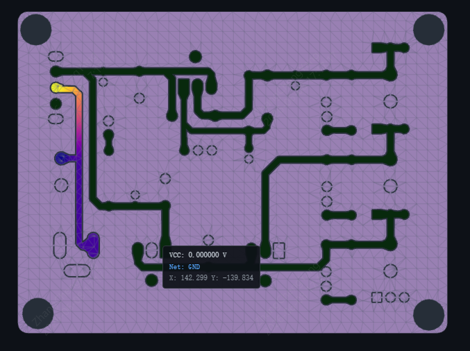

[简体中文](./README.md) | [English](./README.en.md) | [繁體中文](#) | [日本語](./README.ja.md) | [Русский](./README.ru.md)

# PADEN 仿真

嘉立創EDA & EasyEDA 專業版擴展 — 從 PCB 提取數據並進行 PDN 電源分配網路 FEM 分析

> **版本**: 1.0.7 | **分類**: PCB | **關鍵詞**: PDN, Power Analysis, Simulation, 仿真, PI

## 功能

- 從 EasyEDA 提取 PCB 走線、過孔、焊盤、鋪銅數據
- 使用者配置電源軌道（電壓源、電流負載）
- 客戶端預網格化（TypeScript earcut 三角剖分）
- 呼叫本地 Python 後端進行 FEM 求解
- WebGL 視覺化電壓分佈和功率密度熱力圖

## 架構

```
EasyEDA PCB
    │
    ▼
┌─────────────┐     ┌──────────────┐     ┌───────────────┐
│  extract.ts │────▶│  convert.ts  │────▶│   mesh.ts     │  客戶端預網格化
│  數據提取    │     │  數據轉換     │     │  三角剖分      │
└─────────────┘     └──────────────┘     └───────┬───────┘
                                                   │
                                           format_version=2
                                                   │
                                                   ▼
                                         ┌─────────────────┐
                                         │  Python 後端     │
                                         │  main.py         │
                                         │  ├ solver.py     │  FEM 求解
                                         │  ├ problem.py    │  問題定義
                                         │  └ mesh_pure.py  │  網格數據結構
                                         └────────┬────────┘
                                                  │
                                                  ▼
                                         ┌─────────────────┐
                                         │  results.html   │  WebGL 視覺化
                                         └─────────────────┘
```

## 使用流程

### 1.在嘉立創EDA專業版（3.2+）中安裝本擴展
安裝完成後進行配置


### 2.在工程設計下，PCB編輯視窗可以使用本擴展

### 3.透過頂部選單列 高級 → PADEN仿真 → 執行PDN分析

### 4.選取需要分析的參數，然後點擊開始分析





## 快速開始

### 1. 安裝前端依賴

```shell
npm install
```

### 2. 編譯擴展

```shell
npm run compile
```

打包發佈：

```shell
npm run build
```

### 3. 啟動 Python 後端

```shell
cd paden-service
start-paden-windows.bat
```

`start-paden-windows.bat` 會自動：
- 從 GitHub 拉取最新的 `solver.py` 和 `problem.py`
- 安裝 Python 依賴（numpy, scipy, shapely, fastapi, uvicorn, matplotlib）
- 語法檢查
- 啟動服務在 `localhost:5000`

### 4. 在 EasyEDA 中安裝

1. 開啟嘉立創EDA專業版，進入 PCB 編輯器
2. 安裝擴展包，第一次執行時會彈出一個後端服務啟動提示，需要按步驟啟動服務


3. 在選單中選擇 **PDN 分析 → 執行 PDN 分析...**

## 專案結構

```
├── src/                    # TypeScript 前端
│   ├── index.ts            # 主入口，分析流程編排
│   ├── extract.ts          # PCB 數據提取（走線、過孔、焊盤、鋪銅）
│   ├── convert.ts          # 數據轉換 + 預網格化 + 序列化
│   ├── mesh.ts             # 客戶端三角剖分（earcut 半邊數據結構）
│   ├── api.ts              # HTTP 通訊（與 Python 後端）
│   ├── display.ts          # 結果展示（IFrame + Storage + MessageBus）
│   └── types.ts            # 類型定義
├── ui/
│   ├── config.html         # 電源軌道配置介面
│   ├── results.html        # WebGL 視覺化結果介面
│   └── results.tpl.html    # results.html 構建模板
├── paden-service/          # Python 後端
│   ├── main.py             # FastAPI 伺服器（反序列化、求解編排、視覺化）
│   ├── solver.py           # FEM 求解器（來自 GitHub）
│   ├── problem.py          # 問題定義（來自 GitHub）
│   ├── mesh_pure.py        # 網格數據結構（半邊、微分形式）
│   ├── standby/            # solver.py + problem.py 備份
│   └── start-paden-windows.bat           # 一鍵構建啟動腳本
├── config/                 # 構建配置
│   ├── esbuild.common.ts
│   └── esbuild.prod.ts
└── extension.json          # 擴展配置
```

## 使用流程

1. **提取數據** — 從當前 PCB 提取走線、過孔、焊盤、鋪銅區域
2. **配置分析** — 選擇電源網路，設定電壓源和電流負載
3. **客戶端預網格化** — TypeScript 端使用 earcut 演算法對銅皮區域做三角剖分
4. **FEM 求解** — Python 後端接收預網格數據，構建拉普拉斯矩陣並求解電壓分佈
5. **視覺化** — WebGL 渲染電壓分佈熱力圖，支持層切換、網格邊顯示、過孔標記

## 技術棧

**前端**：TypeScript, esbuild, WebGL, earcut

**後端**：Python, FastAPI, numpy, scipy, shapely, matplotlib

**依賴**：`@jlceda/pro-api-types`, `earcut`

## 開源許可

本擴展使用 [Apache License 2.0](https://choosealicense.com/licenses/apache-2.0/) 開源許可協議。

---

## 連結

- **主頁**: https://github.com/easyeda/eext-paden-integration
- **問題回報**: https://github.com/easyeda/eext-paden-integration/issues
